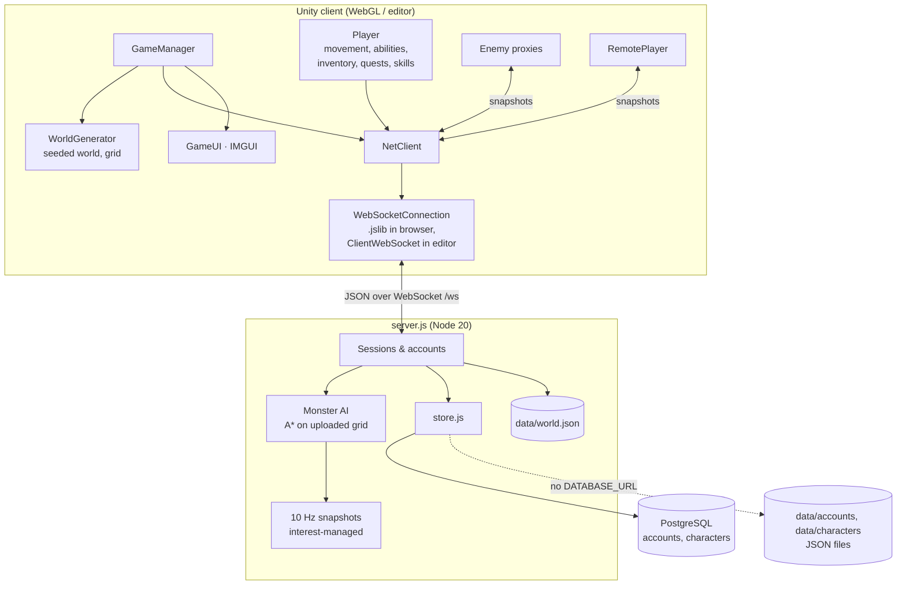

# Architecture overview

## Who owns what

| Concern | Owner | Notes |
| --- | --- | --- |
| Accounts & passwords | Server | scrypt hashes, recovery and reset codes, rate limits (`accounts.js`); logging in again elsewhere kicks the old session. See [Accounts & passwords](../deployment/accounts.md) |
| Storage | Server | `store.js`: PostgreSQL when `DATABASE_URL` is set (Docker), JSON files in `DATA_DIR` otherwise; both import the old one-file-per-character format |
| Character data | Server stores it | Snapshot sent by the client every 20 s and at key moments, plus every 60 s and on logout by the server. Gold, items and companions in it always come from the server's ledger |
| Gold, items, stash, hired companions | **Server** | The client asks (`iop`), the server checks and answers with the whole inventory (`inv`). See [Items and gold](#items-and-gold) |
| Monster spawning, AI, movement, health, death | **Server** | 10 Hz tick; `content.js` defines stats and spawns |
| Monster appearance | Client | `EnemyDef` in `Enemy.cs`, matched by name |
| Damage to monsters | Client predicts, server applies | `hit` messages are capped and range-checked |
| Damage to players | Server decides, client applies armor | `matk` messages; ranged shots are real projectiles you can dodge |
| XP from kills | Server | Sent in the `kill` message with level-difference scaling |
| Loot | **Server** (personal loot) | Rolled per player on each kill and chest; only that player sees and can take it |
| Gathering and crafting | Client (nodes, skill XP), server (what you get) | Resource nodes are part of the seeded world; the server checks the skill level and makes the item |
| Spell effects of other players | Relayed | Cosmetic only (`fx` messages, drawn by `AbilityFx.Remote`) |
| Dungeon layouts, difficulty and instances | Server | Generated by `dungeon.js` per party; the client builds what it is sent |
| Visual effects (spells, fires, companions, gathering) | Client | `SpellFx`, `AbilityFx`, `PropFire`; never affect gameplay |

## World map

The world (terrain, walls, trees, rocks, lakes) is generated by `WorldGenerator` from a **fixed seed**, so every client builds an identical world. The server doesn't run Unity, but it needs the walkability grid to path monsters around obstacles. So:

1. Every client computes an FNV-1a hash of its 576 × 576 walkability bitmap (`WorldGrid.Hash()`).
2. A fresh server asks the first client for the map (`needworld`). The client uploads the bitmap, and the server checks that it matches the claimed hash and stores it in `data/world.json`.
3. The server stores the map with the game build that made it (the build stamp the client sends). A newer build's map replaces it, older clients reload the page, and a client of the same build that somehow built a different map plays on the server's (`grid`). See [Operations → Updating the game](../deployment/operations.md#updating-the-game).

The layout (where walls, trees, rocks and graves go) is drawn from a private `System.Random` seeded with `WorldGenerator.Seed`, separate from the visual randomness, so effects or art can never shift the map.

## Interest management

Each tick the server sends every player one `snap` message containing the monsters within **45** units and the players within **60** units. Monsters with no player within 60 units are put to sleep, unless they're walking home.

## Personal loot and shared kills

When a monster dies, the server credits **everyone on its threat table**. Each of them gets a `kill` message with the XP they earned and the drops the server rolled for them alone (`drops`). Monsters retarget the highest-threat valid player when their current target dies, escapes into town or logs out.

## Items and gold

Gold, the bags, the stash, worn gear and hired companions live in the server's **ledger** for each character (`openLedger` in `server.js`), so a modified client can't make gold or items. The client never changes them itself; it asks:

1. The client sends an item action, `iop {op, ...}`: equip, use, drop, pick up, sort, stash, socket, fuse, sell, buy, craft, gather, turn in a quest, hire, reset talents, open a chest.
2. The server checks it (do you have it, are you in town for a merchant, is the vendor still selling it, your skill level, your gold), carries it out and answers with `iok` (what happened, for the message and effects) or `ierr` (why not).
3. After every change it sends the whole inventory, `inv`, which the client applies as is (`Player.ApplyLedger`).

Loot is rolled by `items.js` (a port of the client's item generator) when a monster dies or a chest is opened, and sent to that player only. Picking it up is another `iop`. Trades move items between two ledgers at once, after checking both sides still have what they offered.

What is still the client's: experience, skill experience, quest progress for kill quests and talents. The server pays each quest's gold and item **once per character**, from `gamedata.json`, which `task gamedata` extracts from `Quests.cs` and `Companion.cs` so the two can't drift apart.

