# Architecture overview

```mermaid
flowchart TB
  subgraph Client["Unity client (WebGL / editor)"]
    GM[GameManager] --> WG[WorldGenerator<br/>seeded world, grid]
    GM --> NC[NetClient]
    GM --> UI[GameUI · IMGUI]
    P[Player<br/>movement, abilities,<br/>inventory, quests, skills] --> NC
    E[Enemy proxies] <-- snapshots --> NC
    RP[RemotePlayer] <-- snapshots --> NC
    NC --> WS[WebSocketConnection<br/>.jslib in browser,<br/>ClientWebSocket in editor]
  end
  WS <-- "JSON over WebSocket /ws" --> SRV
  subgraph Server["server.js (Node 20)"]
    SRV[Sessions & auth] --> MON[Monster AI<br/>A* on uploaded grid]
    SRV --> PERSIST[(characters/*.json<br/>world.json)]
    MON --> SNAP[10 Hz snapshots<br/>interest-managed]
  end
```

## Who owns what

| Concern | Owner | Notes |
| --- | --- | --- |
| Accounts & passwords | Server | scrypt hashes; logging in again elsewhere kicks the old session |
| Character data | Server stores it | Snapshot sent by the client every 20 s and at key moments |
| Monster spawning, AI, movement, health, death | **Server** | 10 Hz tick; `content.js` defines stats and spawns |
| Monster appearance | Client | `EnemyDef` in `Enemy.cs`, matched by name |
| Damage to monsters | Client predicts, server applies | `hit` messages are capped and range-checked |
| Damage to players | Server decides, client applies armor | `matk` messages; ranged shots are real projectiles you can dodge |
| XP from kills | Server | Sent in the `kill` message with level-difference scaling |
| Loot | Client (personal loot) | Rolled locally on `kill`, like WoW's personal loot |
| Gathering and crafting | Client | Resource nodes are part of the seeded world |
| Spell effects of other players | Relayed | Cosmetic only (`fx` messages) |

## World map

The world (terrain, walls, trees, rocks, lakes) is generated by `WorldGenerator` from a **fixed seed**, so every client builds an identical world. The server doesn't run Unity, but it needs the walkability grid to path monsters around obstacles. So:

1. Every client computes an FNV-1a hash of its 288 × 288 walkability bitmap (`WorldGrid.Hash()`).
2. A fresh server asks the first client for the map (`needworld`). The client uploads the bitmap, and the server checks that it matches the claimed hash and stores it in `data/world.json`.
3. Later clients must present the same hash, or they're rejected.

## Interest management

Each tick the server sends every player one `snap` message containing the monsters within **45** units and the players within **60** units. Monsters with no player within 60 units are put to sleep, unless they're walking home.

## Personal loot and shared kills

When a monster dies, the server credits **everyone on its threat table**. Each of them gets a `kill` message with the XP they earned, and each client rolls its own drops. Monsters retarget the highest-threat valid player when their current target dies, escapes into town or logs out.
