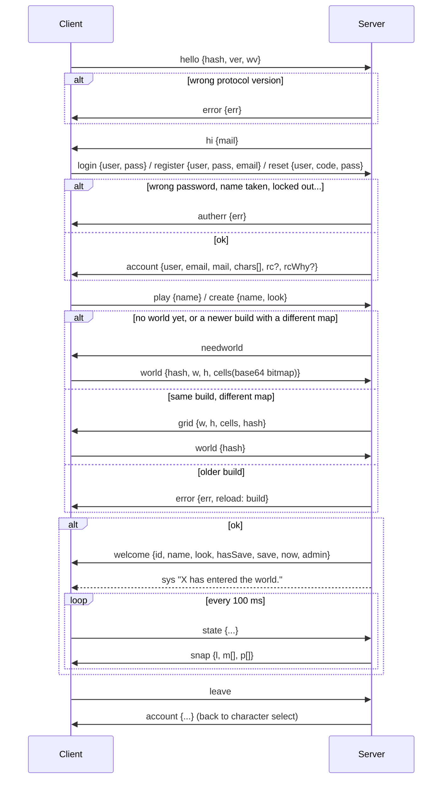

# Network protocol

Every message is a single JSON text frame on the WebSocket at `/ws`, and every message has a `t` (type) field. The C# definitions are in `Assets/Scripts/Net/NetMessages.cs`; the server handlers are the `handlers` object in `server/server.js`.

Protocol version: **5**. It is checked in `hello`.

## Login sequence

The client says `hello`, then logs in to an account (or registers, or resets a password), picks a character, and enters the
world. Account errors come back as `autherr` and leave the connection open, so the player can try again; `error` always ends it.

See [Accounts & passwords](../deployment/accounts.md) for how accounts, recovery codes and resets work.

## Accounts

Client → server. All but `hello` need `hello` first; `login`, `register`, `forgot` and `reset` only work while logged out, the
others only while logged in.

| `t` | Fields | Purpose | Answer |
| --- | --- | --- | --- |
| `hello` | `hash`, `build`, `ver`, `wv` | Version check. `hash` = the client's world map hash, `build` = the game's build stamp (`Application.version`; decides whose map wins, see [Operations](../deployment/operations.md#updating-the-game)), `wv` = `WorldGenerator.LayoutVersion` (only used for converting old saves). A client older than the served build gets `error` with `reload` | `hi`, or `error` |
| `login` | `user`, `pass` | Log in to an account. Logs out any other session of the account | `account` or `autherr` |
| `register` | `user`, `pass`, `email` (optional) | Create an account and log in | `account` with `rc`, or `autherr` |
| `forgot` | `user` (account name or email) | Email a reset code. Same answer whether or not the account exists | `authok`, or `autherr` (no SMTP, too many requests) |
| `reset` | `user`, `code`, `pass` | New password with the recovery code or a reset code (email or admin); logs in | `account` (with a new `rc` if the recovery code was used), or `autherr` |
| `resume` | `user`, `code`, `name` | Back in after a restart, a dropped connection or a reload, with the token from `resume`; logs in and plays hero `name` | `account` then `welcome` (and a fresh `resume`), or `autherr` with `k: "resume"` (the client forgets the token) |
| `chpass` | `old`, `pass` | Change the password; logs out the account's other sessions | `authok` or `autherr` |
| `setemail` | `pass`, `email` | Set the email address (empty removes it) | `authok` or `autherr` |
| `newcode` | `pass` | Replace the recovery code | `rcode` or `autherr` |
| `play` | `name` | Enter the world with one of the account's characters | `welcome` (maybe after `needworld`), or `autherr` |
| `create` | `name`, `look` | Create a character (`look`: `Knight`, `Barbarian`, `Mage`, `Rogue`) and enter the world with it | like `play` |
| `delchar` | `name`, `pass` | Delete a character (only at character select) | `account` with `msg`, or `autherr` |
| `leave` | — | Save and leave the world, back to character select | `account` |

Server → client:

| `t` | Fields | Purpose |
| --- | --- | --- |
| `hi` | `mail` | Version OK; `mail` = the server can send reset emails |
| `account` | `user`, `email`, `mail`, `chars[]` (`{name, look, lvl}`), `msg`, `rc`, `rcWhy` | Logged in: the account and its characters (character select). `rc` = a recovery code to show once; `rcWhy`: `register`, `new` (an imported account's first login) or `used` |
| `autherr` | `err` | An account request failed; the connection stays open |
| `authok` | `msg` | An account request succeeded (password changed, email set, reset email on its way) |
| `rcode` | `rc` | The new recovery code after `newcode` |
| `resume` | `user`, `name`, `k` | Sent on entering the world: a one-time token (`k`) to get back in as this hero without the password, for 12 hours or until the password changes |

## Client → server

| `t` | Fields | Purpose |
| --- | --- | --- |
| `world` | `hash`, `w`, `h`, `cells` | Upload the walkability bitmap (bit set = blocked, LSB first, row-major) |
| `state` | `x`, `z`, `ry`, `hp`, `mhp`, `mp`, `mmp`, `ti`, `lvl`, `mv`, `atk`, `dead`, `body`, `legs`, `weapon`, `helm`, `mdl`, `wk`, `cp` | Own position, health and appearance, 10× per second. `mdl` = hero model, `wk` = hero weapon in hand (`sword`, `axe`, `mace`, `dagger`, `staff` or empty; anything else is dropped), `cp` = companion following them (`hound`, `squire`, `witch`, `ranger`, `acolyte`, `golem` or empty) |
| `hit` | `mid`, `dmg`, `crit` | Report damage dealt to monster `mid` (after armor) |
| `slow` | `mid`, `dur` | Slow a monster (Frost Nova, Fan of Knives, Leap). Capped at 5 s |
| `stun` | `mid`, `dur` | Stun a monster (Shield Bash, Judgement). Capped at 3 s, bosses take 40% of it; within 16 m |
| `vanish` | `dur` | Smoke Bomb: monsters drop and ignore you for up to 6 s |
| `treq` | `id` | Ask player `id` to trade (within 10 m, same instance) |
| `tacc` / `tdecl` | — | Answer a trade request |
| `toffer` | `slots[]`, `gold` | Your current offer: up to 12 bag slots plus gold (items stay in your bags until the trade completes). Resets both acceptances |
| `tok` | — | Accept the current offers |
| `tcancel` | — | Cancel the trade |
| `iop` | `op` + `i`, `j`, `slot`, `n`, `id`, `k`, `name`, `to` | An item or gold action, carried out by the server: `equip i`, `unequip slot`, `use i`, `drop i`, `pickup id`, `sort`, `stash i`, `unstash i`, `socket i` (into `to` = `eq` `slot` or `bag` `j`), `fuse`, `sell i`, `sellcommon`, `vendor k`, `buy k i n name`, `craft name`, `gather name`, `quest k`, `hire k`, `respec`, `chest i`, `rebuild k` (`wood`, `stone` or `gold` for the reeve of a burning town you stand in). Answered by `iok` or `ierr`, then `inv` |
| `beacon` | `i` | Light beacon `i` by a besieged gate (within 4.5 m of it, while the siege is on). Announced to everyone; the state's `bc` shows who lit it |
| `feast` | | Eat at a victory feast's table (within 14 m of the town's middle, once a feast). Answered by `fed`, or a `sys` saying why not |
| `douse` | `id` | A bucket of water on burning roof `id` of a besieged town (within 14 m of it, once every 1.2 s). Answered by `doused` (`id`, `xp`) |
| `adm` | `c` + arguments | Admin command (`tp`, `tpto`, `summon`, `dungeon`, `regen`, `spawn`, `killall`, `time`, `elites`, `announce`, `kick`, `who`, `resetpw`, `give`); refused unless the account is an admin. See [Admin module](../deployment/admin.md) |
| `chat` | `msg` | Chat to everyone. Commands handled by the server: `/who`, `/p` (party), `/w name` (whisper), `/invite name`, `/leave`, `/a` (admin). `/r` is turned into `/w` by the client |
| `pinvite` | `name` | Invite a player to your party (leader only once in a party) |
| `paccept` / `pdecline` | — | Answer a pending invitation (they expire after 60 s) |
| `pleave` | — | Leave your party |
| `pkick` | `id` | Leader removes a member |
| `pshare` | `q` | Offer quest `q` (quest id) to the rest of the party |
| `denter` | `d`, `df` | Enter dungeon `d` (0 Catacombs, 1 Bandit Hideout, 2 Goblin Warrens, 3 Ironvein Deep) at difficulty `df` (0 Normal, 1 Veteran, 2 Nightmare, 3 Hell; ignored when your party is already inside); you must be within 6 m of its entrance. Party members share one copy |
| `dstairs` | — | Take the stairs to the next depth (must be near them) |
| `dleave` | `town` | Leave the dungeon: to the entrance, or to Hollowmere (`town`, after dying) |
| `fx` | `k`, `x`, `z`, `tx`, `tz` | Cosmetic spell effect (drawn by `NetClient.HandleFx`, class abilities by `AbilityFx.Remote`): `fireball`, `nova`, `heal`, `meteor`, `cleave`, `levelup`, `bash`, `holybolt`, `consecrate`, `dshield`, `judgement`, `axe`, `whirl`, `leap`, `warcry`, `chain`, `teleport`, `twin`, `multi`, `knives`, `smoke`, `rain` |
| `ach` | `id` | You earned achievement `id` (from `Achievements.cs`): the server tells your party and the players nearby, once per achievement |
| `emote` | `e` | Play emote `e` (`wave`, `dance`, `bow`, `cheer`, `clap`, `point`, `flex`, `sit`, `sleep`, `jump`, `kick`, `shadowbox`, `guard`) for players nearby |
| `save` | `save` | Character snapshot (`SaveData`). Gold, items and companions in it are ignored: the server saves its own |

## Server → client

| `t` | Fields | Purpose |
| --- | --- | --- |
| `needworld` | — | Ask this client to upload the world map |
| `grid` | `w`, `h`, `cells`, `hash` | Use the server's map (this client built a different one within the same build); reply with `world {hash}` |
| `error` | `err`, `reload` | Fatal error; the socket is closed afterwards. With `reload` (a build stamp), a newer game is out and the page reloads into it |
| `welcome` | `id`, `name`, `look`, `hasSave`, `save`, `now`, `admin` | Entered the world: your session id, the character's name, class and save, and the server clock (ms, drives the day/night cycle). An `inv` follows |
| `inv` | `gold`, `bag[]`, `stash[]`, `eq[]`, `comp[]` | Your whole inventory, after login and every change: 40 bag and 40 stash slots (`Item`, `{}` = empty), worn items, hired companion ids |
| `drops` | `drops[]`, `chest` | Loot on the ground for you only: `{id, x, z, gold, item}` (dropped items, overflow, chest contents) |
| `stock` | `k`, `stock[]`, `restock`, `pmul` | What vendor `k` sells you now, seconds until it restocks, and the town's price factor (its prosperity after its sieges; `buy` charges the price times it, rounded) |
| `iok` | `op` + what happened | An `iop` went through: `name`, `n`, `gold`, `k`, `item`, `rarity`, `burnt`, `target`, `drops` (what didn't fit in your bags). `op` `death`: the gold you lost by dying |
| `ierr` | `op`, `msg`, `id`, `k`, `n` | An `iop` was refused; `msg` says why (empty = say nothing). For `pickup`: `id`, and `n` left on the ground when your bags filled up |
| `snap` | `l` (online count), `m[]`, `p[]` | Nearby monsters `{id,n,l,x,z,ry,hp,mhp,ar,sl,st}` (`sl` slowed, `st` stunned) (elites also `el` name, `af` comma-separated affixes, `sh` shield up) and players `{id,name,x,z,ry,hp,mhp,lvl,mv,atk,dead,body,legs,weapon,helm,mdl,wk,cp,ti}` (`ti` = the title they wear, or empty) |
| `matk` | `mid`, `tid`, `dmg`, `k`, `x`, `z` | Monster attack: `k` = `melee`, `shot`, `nova`, `summon`, `blink` (elite teleports to `x`,`z` from `tx`,`tz`) or `explode` (Fire Enchanted death, area damage at `x`,`z`); `tid` = target session (−1 for area effects) |
| `mdie` | `mid` | Monster died (play the death animation) |
| `kill` | `mid`, `name`, `l`, `xp`, `x`, `z`, `el`, `lb`, `drops[]` | You get credit for a kill (you damaged it, or a party member did within 60 m): award XP, update quests, show your loot (`drops`, as in `drops`) |
| `fx` | `id`, `k`, `x`, `z`, `tx`, `tz` | Another player's spell effect |
| `ach` | `id`, `name`, `k` | A party member or a player nearby earned achievement `k` (its name) |
| `emote` | `id`, `name`, `e` | Another player's emote (play it and print "Alice waves.") |
| `chat` | `id`, `name`, `msg`, `ch` | Chat line. `ch`: empty = everyone, `p` = party, `w` = whisper to you, `wto` = echo of your whisper (`name` = recipient) |
| `party` | `id` (leader), `pm[]` | Your party, sent on every change and once a second: `{id,name,lvl,hp,mhp,mp,mmp,mdl,wk,helm,x,z,ry,dead,di,dn}` (`mdl` = class model, `wk` weapon and `helm` for the portrait, `di` = dungeon instance, `dn` = "The Catacombs, level 2" or empty). Empty `pm` = not in a party |
| `pinv` | `id`, `name` | Someone invites you to their party |
| `qshare` | `id`, `name`, `k` | A party member shares quest `k` |
| `dungeon` | `id`, `l`, `k`, `d`, `n`, `df`, `seed`, `w`, `h`, `cells`, `rooms`, `start`, `exit`, `stairs`, `boss`, `chests` | You entered dungeon instance `id` at depth `l`: the generated layout (walkability bitmap like the world map, rooms as `x,y,w,h` quadruples, positions as `x,z` pairs). `id` 0 = you are back in the overworld at `x`, `z` |
| `tinv` | `id`, `name` | Someone wants to trade with you |
| `topen` | `id`, `name` | The trade window opens with player `id` |
| `tupd` | `items[]`, `gold` | The other player's offer changed (items as JSON strings, acceptances reset) |
| `tmine` | `slots[]`, `gold` | Your own offer as the server took it (slots you don't have and gold you can't pay are dropped) |
| `tok` | `id` | The other player accepted |
| `tdone` | `items[]`, `gold`, `name` | Trade complete: what you received (an `inv` follows) |
| `tclose` | `msg` | Trade cancelled (by either player, distance, dungeon, logout) |
| `tp` | `x`, `z` | Admin teleport: move there (in the current space) |
| `clock` | `now` | The server clock changed (an admin set the time of day) |
| `sack` | `sk[]` | At login (if any) and whenever one starts or ends: the quarters burning after a lost siege `{k,g,x,z,r,left}`: town `k`, gate `g` at `x`, `z`, everything inside its walls within `r` of the gate, seconds `left`. Trade with merchants, smiths and auctioneers is refused there (`ierr`). Sent again when deliveries to the reeve (`iop rebuild`) shorten the fires |
| `invasion` | `iv` | A town invasion's state, whenever it changes: `town`, `gate` (at `gx`, `gz`), `phase` (`warn` the scouts' warning, `gather`, `wave`, `won`, `lost`, `none`), `left` (seconds to the charge, or invaders alive), `wave`, `waves`, `hp` (the gate's integrity), `gd[]` the guards, `paused` (nobody near), `sx`, `sz` the war camp and `n` raiders in it, `bc[]` the beacons `{x,z,l}` (`l` who lit it), `fr[]` burning roofs `{i,x,z,s}` (strength 0..100), `ram` (1 coming, 2 abandoned), `rt` (routed) |
| `gev` | `k` + fields | A siege's deeds, to players near the town: the guards' (`shot` with `f` = fire arrows, `swing`, `hurt`, `die`), `fire` (a roof catches at `x`, `z`; a fire arrow from `sx`, `sz`), `fireout` (`by`), `beacon` (`i`, `by`), `say` (a monster `mid` shouts `msg`: the warlord's taunts), `rout` (the banner fell) |
| `chron` | `rec[]` | At login and after every siege: each walled town's record `{k,h,f,sp,last,ago,g,d,p}`: held, fell, spared, the last result and how many seconds ago, the gate, the last defenders, prosperity -3..3 |
| `after` | `fe[]`, `rp[]`, `gr[]`, `cp[]` | A siege's aftermath, when it changes: victory feasts `{k,x,z,left}`, gate repairs `{k,g,x,z,left}`, graves `{k,g,x,z,n,s}` (count, seed), captives at the raiders' camp `{k,x,z,n,left,c}` (`c` captors left) |
| `rescued` | `k`, `xp` | You helped free town `k`'s captives |
| `fed` | `k`, `s`, `mul` | You ate at town `k`'s victory feast: experience times `mul` for `s` seconds |
| `weather` | `s`, `sky`, `i`, `left` | At login and on every change: season `s` (0 spring, 1 summer, 2 autumn, 3 winter), `sky` (`clear`, `cloudy`, `rain`, `storm`, `fog`; rain and storms fall as snow where it's cold), intensity `i` (0..1), seconds `left` in the season |
| `admwho` | `items[]` | Admin player list: `id\|name\|level\|where` |
| `sys` | `msg` | System message (joins, leaves, boss kills, `/who`) |
| `leave` | `id` | A player left the world |

## Dungeon instances

Each dungeon level is an instance with its own grid, monsters and id. Positions of players in an instance are **instance-local** on the wire (0..72); the client builds the dungeon at an offset (`Dungeon.Origin`, 1000/1000) and converts positions in and out. Snapshots, monster attacks, kills and spell effects only reach players in the same instance, and party updates carry `di` (the member's instance id).

## Server-side validation

- Account and character names must match `^[A-Za-z][A-Za-z0-9_]{2,15}$` and are unique ignoring case; passwords must be 6–128 characters; emails must look like an address and are unique.
- An account has at most 10 characters; `play` and `delchar` only accept the account's own characters.
- Wrong passwords and codes are rate-limited per account and per address, as are registrations and reset emails (see [Accounts → Rate limits](../deployment/accounts.md#rate-limits)).
- Connections that haven't logged in after 15 minutes are closed.
- `hit`: the monster must be within 30 units of the player, and damage is capped at `100 + level × 60`.
- `chat`: limited to 2 per second, 200 characters, with `<` and `>` stripped so it can't inject IMGUI rich-text tags.
- `fx`: limited to 10 per second, and only whitelisted kinds are relayed.
- `state` `ti`: the id of an achievement you have earned (in your save or announced with `ach`) that gives a title; anything else shows no title.
- `ach`: only ids in `gamedata.json`, each announced once per session and character, at most one every 0.3 s.
- `emote`: at most one every 0.8 s, only the ids in `EMOTES` (`content.js`), not while dead.
- `save`: at most 256 KB, and `level` must be between 1 and 100. Its gold, items and companions are replaced by the server's.
- `iop`: every action is checked against the server's ledger: you must have the item, merchants, the stash, Vex and Orla only work in Hollowmere, purchases check the name and price of the current stock, crafting and gathering check the skill level (gathering at most once every 1.2 s), quests pay once per character, loot can only be picked up within 7 m by the player it dropped for (and expires after 5 minutes), and nothing but potions while a trade is open or while dead.
- Trades: both players must be within 10 m in the same instance when accepting, at most 12 items per offer, and an offer change resets both acceptances so nobody can swap items after the other accepted. When both accept, the server checks that the offered items and gold are still there and fit, then swaps everything at once.
- Connections that stop answering pings for 20 seconds are dropped.
