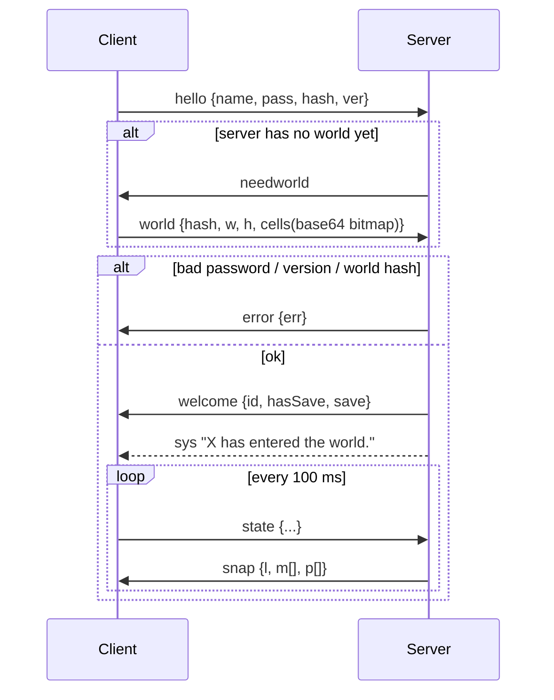

# Network protocol

Every message is a single JSON text frame on the WebSocket at `/ws`, and every message has a `t` (type) field. The C# definitions are in `Assets/Scripts/Net/NetMessages.cs`; the server handlers are the `handlers` object in `server/server.js`.

Protocol version: **4**. It is checked in `hello`.

## Login sequence

## Client → server

| `t` | Fields | Purpose |
| --- | --- | --- |
| `hello` | `name`, `pass`, `hash`, `ver` | Log in, or create the account if the name is new |
| `world` | `hash`, `w`, `h`, `cells` | Upload the walkability bitmap (bit set = blocked, LSB first, row-major) |
| `state` | `x`, `z`, `ry`, `hp`, `mhp`, `lvl`, `mv`, `atk`, `dead`, `body`, `legs`, `weapon`, `helm`, `mdl`, `wk` | Own position, health and appearance, 10× per second. `mdl` = hero model, `wk` = weapon in hand (`sword`, `axe`, `mace`, `dagger`, `staff` or empty), `cp` = companion following them (`hound`, `squire`, `witch`, `ranger`, `acolyte`, `golem` or empty) |
| `hit` | `mid`, `dmg`, `crit` | Report damage dealt to monster `mid` (after armor) |
| `slow` | `mid`, `dur` | Slow a monster (Frost Nova, Fan of Knives, Leap). Capped at 5 s |
| `stun` | `mid`, `dur` | Stun a monster (Shield Bash, Judgement). Capped at 3 s, bosses take 40% of it; within 16 m |
| `vanish` | `dur` | Smoke Bomb: monsters drop and ignore you for up to 6 s |
| `treq` | `id` | Ask player `id` to trade (within 10 m, same instance) |
| `tacc` / `tdecl` | — | Answer a trade request |
| `toffer` | `items[]`, `gold` | Your current offer: up to 12 items as JSON strings (`Item`) plus gold. Resets both acceptances |
| `tok` | — | Accept the current offers |
| `tcancel` | — | Cancel the trade |
| `adm` | `c` + arguments | Admin command (`tp`, `tpto`, `summon`, `dungeon`, `regen`, `spawn`, `killall`, `time`, `elites`, `announce`, `kick`, `who`); refused unless the account is an admin. See [Admin module](../deployment/admin.md) |
| `chat` | `msg` | Chat to everyone. Commands handled by the server: `/who`, `/p` (party), `/w name` (whisper), `/invite name`, `/leave` |
| `pinvite` | `name` | Invite a player to your party (leader only once in a party) |
| `paccept` / `pdecline` | — | Answer a pending invitation (they expire after 60 s) |
| `pleave` | — | Leave your party |
| `pkick` | `id` | Leader removes a member |
| `pshare` | `q` | Offer quest `q` (quest id) to the rest of the party |
| `denter` | `d`, `df` | Enter dungeon `d` at difficulty `df` (0 Normal, 1 Veteran, 2 Nightmare, 3 Hell; ignored when your party is already inside) (0 Catacombs, 1 Bandit Hideout, 2 Goblin Warrens, 3 Ironvein Deep); you must be within 6 m of its entrance. Party members share one copy |
| `dstairs` | — | Take the stairs to the next depth (must be near them) |
| `dleave` | `town` | Leave the dungeon: to the entrance, or to Hollowmere (`town`, after dying) |
| `fx` | `k`, `x`, `z`, `tx`, `tz` | Cosmetic spell effect: `fireball`, `nova`, `heal`, `meteor`, `cleave`, `levelup`, `bash`, `holybolt`, `consecrate`, `dshield`, `judgement`, `axe`, `whirl`, `leap`, `warcry`, `chain`, `teleport`, `twin`, `multi`, `knives`, `smoke`, `rain` |
| `save` | `save` | Full character snapshot (`SaveData`) |

## Server → client

| `t` | Fields | Purpose |
| --- | --- | --- |
| `needworld` | — | Ask this client to upload the world map |
| `error` | `err` | Fatal error; the socket is closed afterwards |
| `welcome` | `id`, `hasSave`, `save`, `now`, `admin` | Login OK: your session id, stored character and the server clock (ms, drives the day/night cycle) |
| `snap` | `l` (online count), `m[]`, `p[]` | Nearby monsters `{id,n,l,x,z,ry,hp,mhp,ar,sl,st}` (`sl` slowed, `st` stunned) (elites also `el` name, `af` comma-separated affixes, `sh` shield up) and players `{id,name,x,z,ry,hp,mhp,lvl,mv,atk,dead,body,legs,weapon,helm,mdl,wk,cp}` |
| `matk` | `mid`, `tid`, `dmg`, `k`, `x`, `z` | Monster attack: `k` = `melee`, `shot`, `nova`, `summon`, `blink` (elite teleports to `x`,`z` from `tx`,`tz`) or `explode` (Fire Enchanted death, area damage at `x`,`z`); `tid` = target session (−1 for area effects) |
| `mdie` | `mid` | Monster died (play the death animation) |
| `kill` | `mid`, `name`, `l`, `xp`, `x`, `z`, `el`, `lb` | You get credit for a kill (you damaged it, or a party member did within 60 m): award XP, update quests, roll loot |
| `fx` | `id`, `k`, `x`, `z`, `tx`, `tz` | Another player's spell effect |
| `chat` | `id`, `name`, `msg`, `ch` | Chat line. `ch`: empty = everyone, `p` = party, `w` = whisper to you, `wto` = echo of your whisper (`name` = recipient) |
| `party` | `id` (leader), `pm[]` | Your party, sent on every change and once a second: `{id,name,lvl,hp,mhp,mdl,x,z,dead}`. Empty `pm` = not in a party |
| `pinv` | `id`, `name` | Someone invites you to their party |
| `qshare` | `id`, `name`, `k` | A party member shares quest `k` |
| `dungeon` | `id`, `l`, `k`, `d`, `n`, `df`, `seed`, `w`, `h`, `cells`, `rooms`, `start`, `exit`, `stairs`, `boss`, `chests` | You entered dungeon instance `id` at depth `l`: the generated layout (walkability bitmap like the world map, rooms as `x,y,w,h` quadruples, positions as `x,z` pairs). `id` 0 = you are back in the overworld at `x`, `z` |
| `tinv` | `id`, `name` | Someone wants to trade with you |
| `topen` | `id`, `name` | The trade window opens with player `id` |
| `tupd` | `items[]`, `gold` | The other player's offer changed (acceptances reset) |
| `tok` | `id` | The other player accepted |
| `tdone` | `items[]`, `gold`, `name` | Trade complete: what you receive. Your own offered items are gone |
| `tclose` | `msg` | Trade cancelled (by either player, distance, dungeon, logout) |
| `tp` | `x`, `z` | Admin teleport: move there (in the current space) |
| `clock` | `now` | The server clock changed (an admin set the time of day) |
| `admwho` | `items[]` | Admin player list: `id\|name\|level\|where` |
| `sys` | `msg` | System message (joins, leaves, boss kills, `/who`) |
| `leave` | `id` | A player logged out |

## Dungeon instances

Each dungeon level is an instance with its own grid, monsters and id. Positions of players in an instance are **instance-local** on the wire (0..72); the client builds the dungeon at an offset (`Dungeon.Origin`, 1000/1000) and converts positions in and out. Snapshots, monster attacks, kills and spell effects only reach players in the same instance, and party updates carry `di` (the member's instance id).

## Server-side validation

- Names must match `^[A-Za-z][A-Za-z0-9_]{2,15}$`; passwords must be 4–64 characters.
- `hit`: the monster must be within 30 units of the player, and damage is capped at `100 + level × 60`.
- `chat`: limited to 2 per second, 200 characters, with `<` and `>` stripped so it can't inject IMGUI rich-text tags.
- `fx`: limited to 10 per second, and only whitelisted kinds are relayed.
- `save`: at most 256 KB, and `level` must be between 1 and 100.
- Trades: both players must be within 10 m in the same instance when accepting, at most 12 items per offer, and an offer change resets both acceptances so nobody can swap items after the other accepted.
- Connections that stop answering pings for 20 seconds are dropped.
