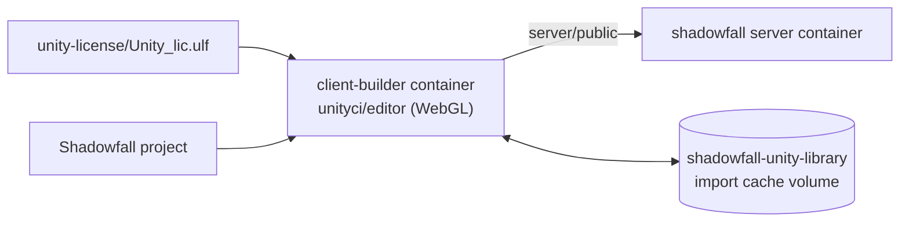

# Building the client in Docker

You can build the WebGL client without installing Unity. `task client:build` runs the Unity editor in a [GameCI](https://game.ci/) container (`unityci/editor:ubuntu-<version>-webgl-3`) and writes the build straight into `server/public`. The running server serves that folder, so players just refresh the page.



## 1. Provide a Unity license

The Unity editor won't run without a license, even in batch mode in a container. The free **Personal** license works. Personal licenses can only be activated by signing in to Unity Hub; there's no command-line activation. The first option below runs Unity Hub for you in a container, so you don't have to install anything:

=== "In your browser (Personal, nothing to install)"

    ```bash
    task license:activate
    ```

    This starts a temporary container running **Unity Hub on a virtual desktop**, which you use from your web browser (noVNC). The command prints a link with a one-time password:

    ```text
    http://<this-server>:6080/vnc.html?autoconnect=1&resize=scale&password=Xk3...
    ```

    1. Open the link. You'll see Unity Hub; scroll to the bottom of the terms and click **Agree**.
    2. Click **Sign in**. Firefox opens inside the desktop; sign in to your Unity account. When Firefox asks to open the `unityhub` link, allow it. You're then back in the Hub, signed in.
    3. Open **Preferences** (gear icon) **→ Licenses → Add → Get a free personal license**. Skip any offer to install an editor.

    As soon as Unity Hub writes the license, it's saved to `unity-license/Unity_lic.ulf` (readable only by you) and the container stops and removes itself. Press ++ctrl+c++ to cancel at any time.

    | Setting | Default | Purpose |
    | --- | --- | --- |
    | `LICENSE_HELPER_PORT` | `6080` | Port for the browser desktop |
    | `LICENSE_HELPER_BIND` | `0.0.0.0` | Set to `127.0.0.1` to only allow access through an SSH tunnel |
    | `VNC_PASSWORD` | random | Fixed password instead of a random one |

    !!! tip "Most private: SSH tunnel"
        The desktop is password-protected, but it's served over plain HTTP. On a remote server, prefer keeping it private:

        ```bash
        # on the server
        LICENSE_HELPER_BIND=127.0.0.1 task license:activate
        # on your computer
        ssh -L 6080:localhost:6080 you@your-server   # then open the printed link with localhost
        ```

=== "License file (from an existing Unity Hub)"

    1. On any computer, install [Unity Hub](https://unity.com/download), sign in, and activate a Personal license (**Preferences → Licenses → Add**).
    2. Copy the activated license file into the project as `unity-license/Unity_lic.ulf`:

        | OS | License file location |
        | --- | --- |
        | Windows | `C:\ProgramData\Unity\Unity_lic.ulf` |
        | macOS | `/Library/Application Support/Unity/Unity_lic.ulf` |
        | Linux | `~/.local/share/unity3d/Unity/Unity_lic.ulf` |

    `unity-license/` is in `.gitignore`, so the file never gets committed.

=== "License in an environment variable"

    Handy for CI secrets:

    ```bash
    export UNITY_LICENSE="$(cat /path/to/Unity_lic.ulf)"
    task client:build
    ```

=== "Serial (Pro / Plus)"

    ```bash
    export UNITY_SERIAL="SC-XXXX-XXXX-XXXX-XXXX-XXXX"
    export UNITY_EMAIL="you@example.com"
    export UNITY_PASSWORD="..."
    task client:build
    ```

    The seat is activated before the build and returned afterwards, even if the build fails.

## 2. Build

```bash
task client:build
```

What happens:

1. Task reads the Unity version from `ProjectSettings/ProjectVersion.txt` and picks the matching image, e.g. `unityci/editor:ubuntu-6000.0.23f1-webgl-3`. The first run downloads several GB.
2. `tools/docker-build-client.sh` installs the license and runs the same `Shadowfall.EditorTools.ShadowfallBuild.BuildWebGL` method as the editor menu.
3. Files the build creates in your project (scene, the variants material, `server/public`) are handed back to your user, so nothing is left owned by root.

Without Task:

```bash
cd server
UNITY_VERSION=6000.0.23f1 HOST_UID=$(id -u) HOST_GID=$(id -g) docker compose --profile build run --rm client-builder
```

The `client-builder` service sits in a compose **profile**, so `docker compose up` / `task up` never starts it by accident.

## Build speed

The first build imports the whole project, which takes several minutes. The import result (`Library/`) is kept in the `shadowfall-unity-library` Docker volume, so later builds only recompile what changed. If a build behaves strangely after a Unity upgrade, run `task client:clean-cache` to start fresh.

Give Docker at least **8 GB of memory**. WebGL builds of IL2CPP code are memory-hungry.

## One-command release

```bash
task deploy     # = task client:build && task up
```

## Changing the Unity version

Update `ProjectSettings/ProjectVersion.txt`, for example by opening the project in a newer editor. The Docker build then uses the matching `unityci/editor` image. Check that an image exists for your version on [Docker Hub](https://hub.docker.com/r/unityci/editor/tags?name=webgl).
