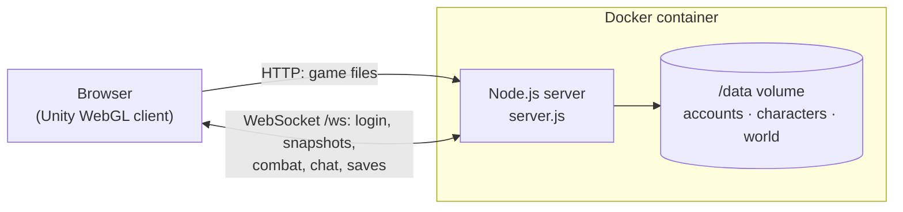

# Shadowfall

**Shadowfall** is an online, browser-playable, top-down action RPG built with Unity. It mixes three classics:

| Inspiration | What Shadowfall takes from it |
| --- | --- |
| **Diablo** | High-angle camera, click-to-move and click-to-attack, health & mana orbs, randomized loot with Common / Magic / Rare / Legendary rarities, attribute points on level-up |
| **World of Warcraft** | Always-online shared world, accounts, quest givers with `!` and `?` markers, an ability bar with cooldowns, unit frames, chat, safe-zone village, personal loot |
| **RuneScape** | Gathering and crafting professions (Woodcutting, Mining, Fishing, Smithing, Cooking) on the classic 1–99 XP curve |

Everything you see in the game — terrain, village, trees, monsters, UI — is generated from code, so the Unity project contains no scenes, prefabs or art assets to manage.



## Where to go next

<div class="grid cards" markdown>

- :material-rocket-launch: **[Quick start](getting-started/quickstart.md)**

    Build the WebGL client and run the server with Docker in a few minutes.

- :material-gamepad-variant: **[Controls](gameplay/controls.md)**

    Mouse and keyboard reference for playing.

- :material-docker: **[Deployment](deployment/docker.md)**

    Host it on your own server, behind HTTPS.

- :material-sitemap: **[Architecture](architecture/overview.md)**

    How the client and server split the work, and the network protocol.

</div>

## Project layout

```text
Shadowfall/
├── Assets/
│   ├── Scripts/            # all game code (C#)
│   ├── Editor/             # "Shadowfall > Build WebGL" menu + headless build entry point
│   ├── Plugins/WebGL/      # browser WebSocket bridge (.jslib)
│   └── WebGLTemplates/     # full-window HTML page for the browser build
├── Packages/ ProjectSettings/
├── server/                 # Node.js game server + Dockerfile + docker-compose.yml
│   ├── server.js           # HTTP static host + WebSocket game server
│   ├── content.js          # monster stats and spawn tables
│   ├── public/             # WebGL build output is written here
│   └── test/smoke.js       # end-to-end server test
├── tools/compile-check/    # compile the C# without Unity
├── docs/ + mkdocs.yml      # this documentation
└── Taskfile.yml            # common commands (task --list)
```
